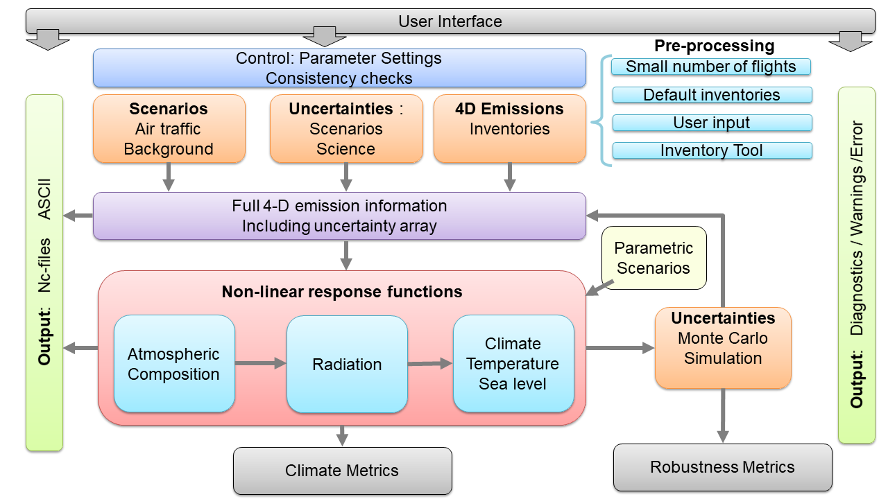

# OpenAirClim

[](https://zenodo.org/doi/10.5281/zenodo.13682728)


## Description

OpenAirClim is a model for simplified evaluation of the approximate chemistry-climate impact of air traffic emissions. The model represents the major responses of the atmosphere to emissions in terms of composition and climate change. Instead of applying time-consuming climate-chemistry models, a response model is developed and applied which reproduces the response of a climate-chemistry model without actually calculating ab initio all the physical and chemical effects. The responses are non-linear relations between localized emissions and Radiative Forcing and further climate indicators. These response surfaces are contained within look-up tables. OpenAirClim builds upon the previous AirClim framework (see section [References](##-references)). In comparison with AirClim, following new features are introduced:

- Standardized formats for configuration file (user interface) and emission inventories (input) and program results (output)
- Possibility of full 4D emission inventories (3D for several time steps)
- Non-linear response functions for NOx including contribution approach (tagging) and dependency on background
- Contrail formation also depending on fuels and overall efficiencies
- Inclusion of different fuels
- Choice of different CO2 response models
- Choice of temperature models and sea-level rise
- Uncertainty assessment and Robustness Metric based on Monte Carlo Simulations
- Parametric scenarios as sensitivities, e.g. at post-processing level: climate optimized routings

### Scientific Background

The impact of aviation on climate amounts to approximately 5% of the total anthropogenic climate warming. A large part of the aviation’s impact arises from non-CO2 effects, especially contrails and nitrogen oxide emissions. Impact of non-CO2 effects depend in particular on the location and time of emissions, hence a regional dependence of impacts exists. As impacts of individual non-CO2 effects show a different spatial dependence, the relationship between impacts and associated emissions can be best described in non-linear relationships, i.e. equations or algorithms based on look-up tables. Specifically, the climate impact of an aircraft depends on where (and when) an aircraft is operated. In addition, using different types of fuel generally changes the importance of the non-CO2 effects.

## Layout


<figcaption>Overview on the layout of the OpenAirClim 3.0 framework</figcaption>

- User interface for settings in the run control and outputs (<grey>grey</grey>)
- Definition of background conditions, such as aviation scenarios, uncertainty ranges and aviation inventories (<orange>orange</orange>)
- A link to a pre-processor for aviation inventories (<blue>light blue</blue>).
- Processor for a full 4D-emission inventory at multiple timesteps (<magenta>violet</magenta>)
- A framework for the application of non-linear response functions (<red>red</red>) to these emission inventories.
- Response functions for CO2 and climate / temperature and sea-level changes
- Parametric scenarios as sensitivities (<yellow>yellow</yellow>), e.g. at post-processing level: climate optimized routings
- Output: Warnings, errors (log files), climate indicators and diagnostics (<green>green</green>), values of climate metrics and robustness metrics (<grey>grey</grey>)


## Installation

If you build OpenAirClim from source, you first have to access the [repository](https://github.com/dlr-pa/oac). To obtain the repository, the most convenient way is using following [Git](https://git-scm.com/) command:
```
git clone https://github.com/dlr-pa/oac.git
```

There are two options to install the package:

### Installation via conda environment

If you have chosen this method, the [conda](https://docs.conda.io/projects/conda/en/latest/index.html) or [mamba](https://mamba.readthedocs.io/en/latest/index.html) package manager has to be installed first.

The source code includes configuration files `environment_xxx.yaml` that enable the installation of a virtual conda environment with all required dependencies. This installation method is suitable for working across platforms. To create an environment from that file, change directory to the root folder of the downloaded source and execute following command:
```
$ conda env create -f environment_xxx.yaml
```

This installation method allows you to run OpenAirClim locally within the downloaded directory only. In order to be able to run OpenAirClim system-wide, the `PYTHONPATH` variable has to be changed properly that the Python interpreter finds the openairclim package.

After having installed the conda ennvironment and required dependencies, proceed with the steps described in section [Getting started](##getting-started). 

### Installation via pip

The prerequesite for this installation method is to have installed Python version >= 3.4. Then, the installer program `pip` is included by default. In your console, change directory to the root folder of the dowloaded source and execute following command:
```
$ pip install .
```
In order to install OpenAirClim in *editable mode*, use the -e flag:
```
$ pip install -e .
```
If you contribute to the software development of OpenAirClim, extra packages are required. In order to install both, normal and extra dependencies, execute following command (with or without -e flag):
```
$ pip install ".[dev]"
```
After having installed the conda ennvironment and required dependencies, proceed with the steps described in section [Getting started](##getting-started). 

<!--
## Installation via built distribution
TODO Add this section, after having implemented a suitable CI/CD pipeline for generating wheel files.

TODO Add link to GitHub .whl file

Download the corresponding wheel file and execute the following command:
```
$ pip install openairclim-xxx-xxx.whl
```
In order to install both, normal and extra software development dependencies, execute following command:
```
$ pip install 'openairclim-xxx-xxx.whl[dev]'
```
-->

## Getting started


### Download emission inventories
Air traffic emission inventories are essential input to OpenAirClim. You can [download](https://doi.org/10.5281/zenodo.11442323) example emission inventories based on the DLR project [Development Pathways for Aviation up to 2050 (DEPA 2050)](https://elib.dlr.de/142185/). These inventories comprise realistic emission data sets.

Depending on the settings made in the configuration file, the computational time of the configured simulations could be long. If you are more interested in testing or developing OpenAirClim software, you might want to generate artificial data.

### Create input data
If you do not have custom input files available, input files with artificial data can be autogenerated using command line scripts. For that, change directory to [utils/](utils/) and execute following commands in order to create artificial input files:
```
$ cd utils/
$ python create_artificial_inventories.py
$ python create_time_evolution.py
```
The script `create_artificial_inventories.py` creates a series of inventories comprising random emission data. The script `create_time_evolution.py` creates two time evolution files, controlling the temporal evolution of the emission data: one file is intended for normalizing inventory emission data, and the other file is intended for scaling inventory emission data along the time axis. Emission inventories and time evolution files are both .nc files and are located in directory [example/repository](example/repository/).

### Create test files
If you contribute to the software development of OpenAirClim, you will probably execute the testing procedures which require additional test files. Following command creates these files:
```
$ python create_test_files.py
```

## Documentation

### Build API documentation

OpenAirClim modules, classes and functions are documented by *docstrings*. This application programming interface (API) documentation is written alongside the code itself. The API documentation can by extracted and converted into nice looking formats such as html pages. In order to build OpenAirClim's API documentation, first make sure that you have installed the [Sphinx](https://www.sphinx-doc.org/en/master/index.html) package. Then execute following commands for building the API documentation in html format:

```
$ cd docs/
$ make html
```

The generated html files can be found under [docs/_build/html/](docs/).

### Program workflows
Some of the most relevant program [workflows](docs/workflows/workflows.md) are described separately. These descriptions give an overview over high-level routines which would be difficult to understand by the API documentation alone.

### Scientific bases
A description of the scientific bases of OpenAirClim will be added in the upcoming versions.

## Usage

After installation, the package can be imported and used in Python scripts:
```
import openairclim as oac
```

Refer to the [example/](example/) folder in the repository for a minimal example demonstrating the OpenAirClim framework.


## Roadmap

Major planned software releases and milestones for the project planning are:

- OpenAirClim 2.8
    - 4D-Emission-module finalized
    - CO2 concentration changes finalized
    - Temperature evolution and climate metrics finalized
    - Some response functions available, e.g. for ozone
- OpenAirClim 3.0
    - as described in the [layout](##Layout).

## References
- Grewe, V., & Stenke, A. (2008). AirClim: an efficient tool for climate evaluation of aircraft technology. Atmospheric Chemistry and Physics, 8(16), 4621-4639.
- Dahlmann, K. (2011). A method for the efficient evaluation of climate optimisation measures for air transport [Eine Methode zur effizienten Bewertung von Maßnahmen zur Klimaoptimierung des Luftverkehrs] (Doctoral dissertation, Ph. D. Thesis, Ludwig-Maximilians-Universität München, Munich).
- Hüttenhofer, L. (2013). Parametrisierung von Kondensstreifenzirren für AirClim 2.0 (Bachelor Thesis, Ludwig-Maximilians-Universität München, Munich). 
- Dahlmann, K., Grewe, V., Frömming, C., & Burkhardt, U. (2016). Can we reliably assess climate mitigation options for air traffic scenarios despite large uncertainties in atmospheric processes?. Transportation Research Part D: Transport and Environment, 46, 40-55.
- Grewe, V., Bock, L., Burkhardt, U., et al. (2017). Assessing the climate impact of the AHEAD multi-fuel blended wing body. Meteorologische Zeitschrift, 26(6), 711-725.
- Leipold, A. et al. (2021) DEPA 2050 – Development Pathways for Aviation up to 2050 (Final Report). https://elib.dlr.de/142185/


## Support
<!-- TODO *probably GitHub issue tracker and email addresses of contacts* -->

## Contributing
Contributions are very welcome. Please read our [contribution guidelines](CONTRIBUTING.md) to get started.

## Authors and acknowledgment
<!-- *Show your appreciation to those who have contributed to the project.* -->

## License
The license of the OpenAirClim sofware can be found [here](LICENSE).
