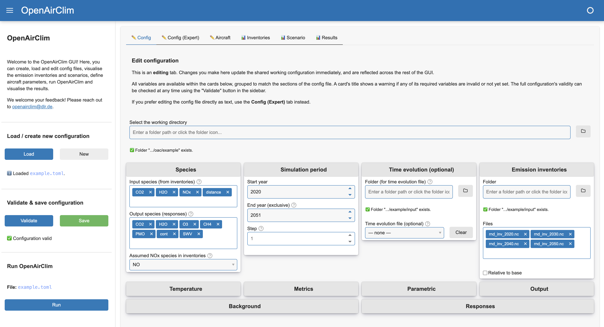

Graphical User Interface
========================

Since v0.17, OpenAirClim ships with an optional graphical user interface (GUI).
The GUI provides a visual way to create, load and edit configuration files, 
inspect input data, run simulations and explore results, without having to
write or edit TOML by hand or work in a python console.

The GUI is in active development. If you have any suggestions on improvement,
please reach out to openairclim@dlr.de or add an issue on
`GitHub <https://github.com/dlr-pa/oac>`__.

Why use the GUI?
----------------

The GUI is particularly useful for setting up and sanity-checking an
OpenAirClim simulation. It provides functionality to:

- **Edit config files**: use an existing config file as a baseline or start from scratch, editing using a form with inline field descriptions or making changes to the raw TOML directly. The GUI provides feedback to validity without having to run OpenAirClim.
- **Visualise emission inventories**: compare the vertical and latitudinal profiles of various emission inventories.
- **Visualise scenarios**: visualise how emissions evolve over time, including any normalisation or scaling applied via a time evolution file. For emission inventories with multiple aircraft identifiers, understand how the global fleet changes over time.
- **Define aircraft parameters**: define or derive aircraft and fuel parameters required for the simulation. This is particularly important for the analysis of contrails.
- **View results**: load a completed simulation's output NetCDF file and explore the results as interactive plots.

Because every tab reads from and writes to the same underlying configuration,
changes made in one tab (e.g. adding an emission inventory, changing the
simulation period) are immediately reflected in the others, making it easier to
catch configuration mistakes before running OpenAirClim.

.. note::

    The GUI is a convenience layer around the existing OpenAirClim
    configuration and simulation workflow. It does not replace the underlying
    `.toml` configuration format - files created or edited in the GUI remain as
    standard OpenAirClim config files that can also be used from the command
    line or in a python script. Power users will generally find that it remains
    easier to set up simulations using the conventional methods, rather than
    through the GUI.

Installation
------------

The GUI requires additional dependencies on top of a standard OpenAirClim
installation. See :ref:`Installing the GUI <installing-the-gui>` for the
commands to install these dependencies with conda or pip.

Running the GUI
---------------

Once the dependencies are installed, launch the GUI from the command line. Make
sure that you have the right environment active in the console.

.. code-block:: bash

    oac-gui

(equivalently, ``python -m openairclim.gui``)

This starts a local Panel server and opens the GUI in your default web browser.
You can pre-load a config/results file or change the port that the server runs
on using optional arguments, i.e.:

.. code-block:: bash

    oac-gui --config path/to/config.toml --results path/to/results.nc --port 5006

The GUI can also be launched from within Python:

.. code-block:: python

    from openairclim.gui import launch
    launch(config_path="path/to/config.toml", results_path="path/to/results.nc")

Typical workflow
----------------

The sidebar, visible on every tab, drives the overall workflow:

1. **Select a working directory.** All relative paths inside a configuration
   (emission inventory, response and background directories, output
   directory) are resolved against this folder.
2. **Load an existing configuration file, or start a new blank one.**
   Loading a file automatically derives the working directory from its
   location and runs full validation.
3. **Edit the configuration** across the Config, Inventories, Scenario and
   Aircraft tabs. Edits made in one tab are immediately visible in the
   others, since they all share the same underlying configuration.
4. **Validate.** The Config tab's card titles show a ⚠️ warning for any
   section that is missing required data; the sidebar's Validate button runs
   the same checks OpenAirClim itself would run before a simulation,
   including that every referenced file actually exists.
5. **Save** the configuration to a `.toml` file once it validates
   successfully.
6. **Run** OpenAirClim directly from the sidebar, then switch to the Results
   tab to explore the output.

Upcoming features
-----------------

The GUI is in active development. The following features are top of the
development list. Please get in touch to suggest other features using the email
above, or by opening an issue on `GitHub <https://github.com/dlr-pa/oac>`__.

- **Inventory editing**: shift emission inventories in latitude, longitude or altitude; introduce or remove aircraft identifiers; select only certain areas. Will be developed in tandem with `gedai <https://github.com/liammegill/gedai>`__.
- **Time evolution editing**: modify evolution of emissions, emission indices and fleet distribution over time.
- **Improve performance for large emission inventories**: currently, opening (very) large emission inventories requires a lot of memory and can take a long time or crash the GUI.
