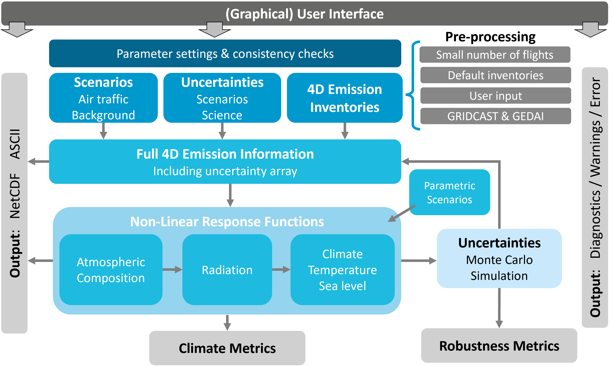

OpenAirClim Documentation
=========================

Welcome to the OpenAirClim documentation!

OpenAirClim is an open-source response model for quantifying the climate impact
of air traffic emissions. Rather than explicitly simulating physical processes,
it uses response functions derived from comprehensive climate-chemistry models.
This makes OpenAirClim particularly fast and efficient, with individual runs
taking seconds to minutes on a conventional computer.

Motivation
----------

Aviation operations account for around 3.5% of Effective Radiative Forcing
:cite:`leeContributionGlobalAviation2021` and its share is expected to grow.
A large part of the aviation's impact arises from non-CO2 effects, especially
`contrails <background/contrails>`_
:cite:`burkhardtMitigatingContrailCirrus2018, bickelContrailCirrusClimate2025`
and nitrogen oxide emissions
:cite:`stevensonRadiativeForcingAircraft2004, myhreRadiativeForcingDue2011`.
The impact of non-CO2 effects is highly dependent on the location and time of
the emission
:cite:`lundEmissionMetricsQuantifying2017, frommingInfluenceWeatherSituation2021`,
as well as on the characteristics of the emitting aircraft. Emerging aircraft
and fuels (e.g. SAF, hydrogen, hybrid-electric) demand new, open and efficient
tools to quantify their climate impacts. However, existing models are either
closed, too general or computationally intense.

OpenAirClim and its add-ons constitute an open-source framework to rapidly
model aviation emissions and their climate response: supporting science,
industry and policy. Development is being led by the German Aerospace Center
(DLR)'s `Institute of Atmospheric Physics <https://www.dlr.de/de/pa/>`__ and
includes `various research and industry partners <governance>`_.

Highlights
----------

OpenAirClim builds upon the previous AirClim framework. Compared to AirClim,
the new OpenAirClim framework:

- Provides standardised, open formats for the simulation configuration file, 
  emission inventories and results
- Provides a `Graphical User Interface (GUI) <gui>`_ for interactive
  configuration and results exploration
- Handles **multiple emission inventories** over time (4D dependence)
- Allows `attribution of climate impact <background/attribution>`_ to specific
  aircraft or fleets
- Implements **tagging** for atmospheric chemistry
- Extends contrail calculations to **novel aviation fuels**
- Enables the calculation of `parametric scenarios <background/parametric>`_ at
  post-processing level, e.g. climate optimised routing
- Provides **uncertainty and robustness metrics** (work in progress)
- Provides various outputs, including time series of radiative forcing and
  temperature change, various climate metrics and sea-level rise

Typical use cases
-----------------

OpenAirClim is aimed both at research and industry. Typical research questions
that can be answered by using OpenAirClim relate to:

- fleet-wide scenarios, e.g. the introduction of a new aircraft type; climate
  impact of operations from a specific airline or airport
- aviation industry scenarios, e.g. the introduction of a new fuel type; 
  climate-optimal distribution of SAF
- operational procedures, e.g. intermediate stop operations; flying lower and
  slower

Layout
------

    Overview of the OpenAirClim framework

The OpenAirClim framework is shown in the above figure. The main aspects are:

- A (graphical) user interface for controlling simulation settings (top bar)
- Main inputs: underlying air traffic scenario, background atmospheric
  concentrations, uncertainty ranges and aviation emission inventories
- Built-in functionality and add-ons to pre-process scenarios and emission
  inventories (e.g. GRIDCAST and
  `GEDAI <https://liammegill.github.io/gedai/>`__)
- A processor for handling multiple emission inventories of time (4D
  dependence)
- A framework for the application of non-linear response functions, calculating
  the impact on atmospheric composition, radiation, temperature and sea level
- Parametric scenarios and sensitivities at post-processing level
- Outputs: time series of Radiative Forcing and temperature change; climate
  metrics, robustness metrics and diagnostics

Navigation
----------

This website provides documentation and examples to help new users get started.
If you need support or would like to get in touch, contact information is
available `here <contact_support>`_. The source code can be found on
`GitHub <https://github.com/dlr-pa/oac>`__.

.. toctree::
   :maxdepth: 1
   :caption: Getting Started

   quickstart
   user_guide
   gui
   demos

.. toctree::
   :maxdepth: 1
   :caption: Scientific Background

   background
   publications
   bibliography

.. toctree::
   :maxdepth: 1
   :caption: API Reference

   api_ref
   changelog

.. toctree::
   :maxdepth: 1
   :caption: Project & Community

   governance
   contact_support

.. toctree::
   :hidden:

   imprint
   accessibility-statement
   privacy-policy
   terms-of-use
