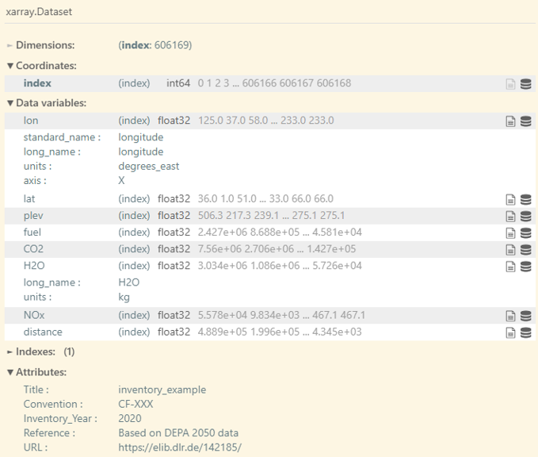

# Input data

OpenAirClim requires several input data to be present before executing a
simulation run.

## Configuration file

A configuration file serves as the main user interface to the OpenAirClim
framework. The [TOML](https://toml.io/en/) format is used, which is known for
its simple syntax and human readability. Refer to `example/example.toml` for
an example configuration.

The configuration file is structured using *tables* which are collections of
key/value pairs. Each table is defined by a header, i.e. a `[string]` enclosed
by square brackets. Each table represents a section of the configuration file.

The comments in `example.toml` describe specific settings more in detail. Here,
an overview over the different tables (sections) of the configuration file is
given:

- `[species]` This section defines the atmospheric species present in the
  emission inventories as well as the desired output species. Note that the
  name of the input and output species can differ. For example, a ``"NOx"``
  input can produce an output for ``"O3"``, ``"CH4"``, ``"PMO"`` and ``"SWV"``.
  Use the [GUI](../gui.rst) to ensure that your combination is correct.
- `[inventories]` This section specifies the input directory and emission
  inventories used for the simulation run. Additionaly, "base" emission
  inventories can be defined, which describe background air traffic if the
  main inventories only constitute a subset of global air traffic. This is only
  relevant for the computation of the contrail climate impact.
- `[output]` This section defines the simulation output. Using the flags
  `run_oac` (calculate all species), `run_metrics` (calculate climate metrics),
  `run_plot` (generate plots) and `concentrations`, parts of the simulation
  workflow can be switched on and off.
- `[time]` This section defines the simulation period for the simulation. The
  `range` setting defines the period - note that it is currently not possible
  to use a step other than one year
  [(see #116)](https://github.com/dlr-pa/oac/issues/116). If `file` is set in
  this section, an additional time evolution is read and processed. Please 
  refer to [Time Evolution](evolution.md) for more details.
- `[background]` This section defines the atmospheric background, notably the
  concentration of CO₂, CH₄ and N₂O. OpenAirClim's repository data includes the
  SSP scenarios by default. `dir` can be left unset to use the shared
  repository data cache (see {doc}`Downloading repository data <installation>`)
  or set explicitly to point at your own data.
- `[responses]` This section comprises settings of the implemented response
  surfaces and methodologies used. As with `[background]`, `dir` can be left
  unset to use the shared repository data cache instead of a manually specified
  folder.
- `[temperature]` This section defines the climate sensitivity parameters and
  efficacies of atmospheric species relevant for the computation of temperature
  changes.
- `[metrics]` The array `types` defines the climate metrics which should be
  computed and written to the output. The arrays `H` and `t_0` define time
  horizons and start times for the metrics calculations. The program iterates
  over these arrays permuting over all combinations.
- `[aircraft]` The strings in array `types` correspond to aircraft identifiers
  present in the emission inventories. This functionality is convenient for the
  classification of different aircraft types with different properties relevant
  for the climate impact calculation. For the contrail module, a set of
  aircraft-specific variables are required
  (see the {doc}`contrail module user guide <contrails>`). This data can also
  be provided as a .csv file. The most convenient way of viewing and editing
  this data is through the [GUI](../gui.rst).
- `[parametric]` This section enables a post-processing parametric approach for
scaling CO₂ emissions and non-CO₂ radiative forcing values, as an alternative
to running the full OpenAirClim workflow. See the
[parametric scenarios](../background/parametric.rst) documentation for details.

## Emission inventories

The emission inventories comprise spatially resolved aircraft emissions on a
yearly basis, stored as netCDF files using a flat data structure, i.e. an
unordered list of entries. Only the naming conventions and units defined in the
example inventories should be used. The entry `Inventory_Year` in the attribute
section of the netCDF file defines the inventory year.



If this is your first time using OpenAirClim, we recommend starting with the
example or artificially generated emission inventories. The realistic emission
data sets created as part of the DLR internal
[Development Pathways for Aviation up to 2050 (DEPA 2050)](https://elib.dlr.de/142185/)
project, comprising global air traffic in 5-year steps between 2020 and 2050,
can be downloaded from [Zenodo](https://doi.org/10.5281/zenodo.11442322) using
the command line:

```bash
oac-download-zenodo 11442322 -o "example/input/"
```

Depending on the settings chosen in the configuration file, the computational
time of the configured simulations could be long. If you are testing or
developing OpenAirClim, artificially generated data may be more convenient. To
generate a series of emission inventories comprising random emission data using
the built-in generator:

```bash
oac-create-artificial-inventories -o "example/input/"
```

It is also possible to create emission inventories from other sources, such as
from ADS-B data or using a trajectory generator. Check out the OpenAirClim
addon [gedai](https://liammegill.github.io/gedai) if you are interested in 
this. Please use its own Issues workflow on
[GitHub](https://github.com/liammegill/gedai) for questions specific to these
conversion tools. Be aware that generating OpenAirClim-compatible emission
inventories in this manner can be time-consuming and computationally expensive.

## Time evolution (optional)

If no extra evolution file is specified in the configuration, OpenAirClim
performs a temporal interpolation between discrete inventory years.
Alternatively, a time evolution of type **normalization** or **scaling** can be
specified in another netCDF file. For more details on that topic, including how
to generate example evolution files, refer to the {doc}`evolution`
documentation.
