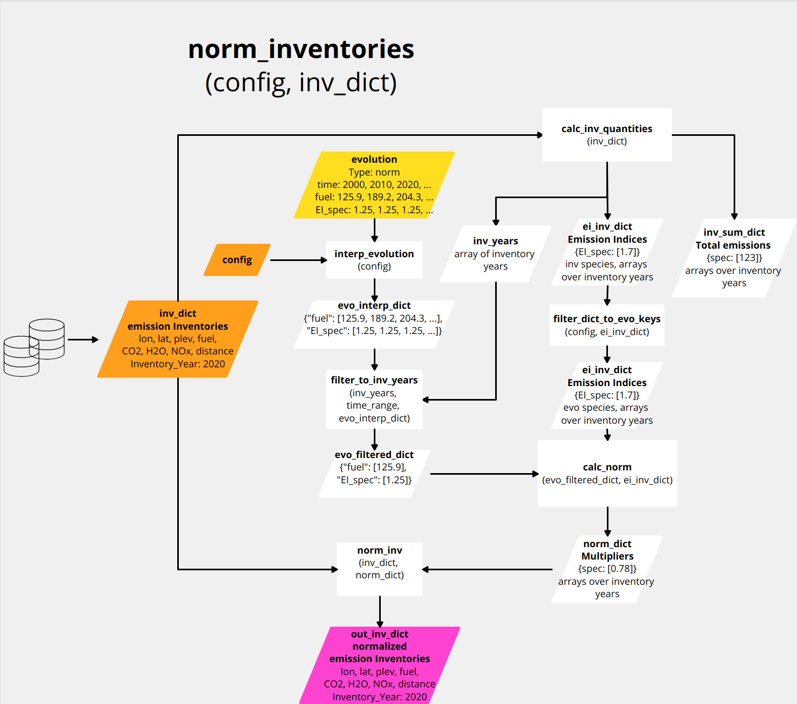
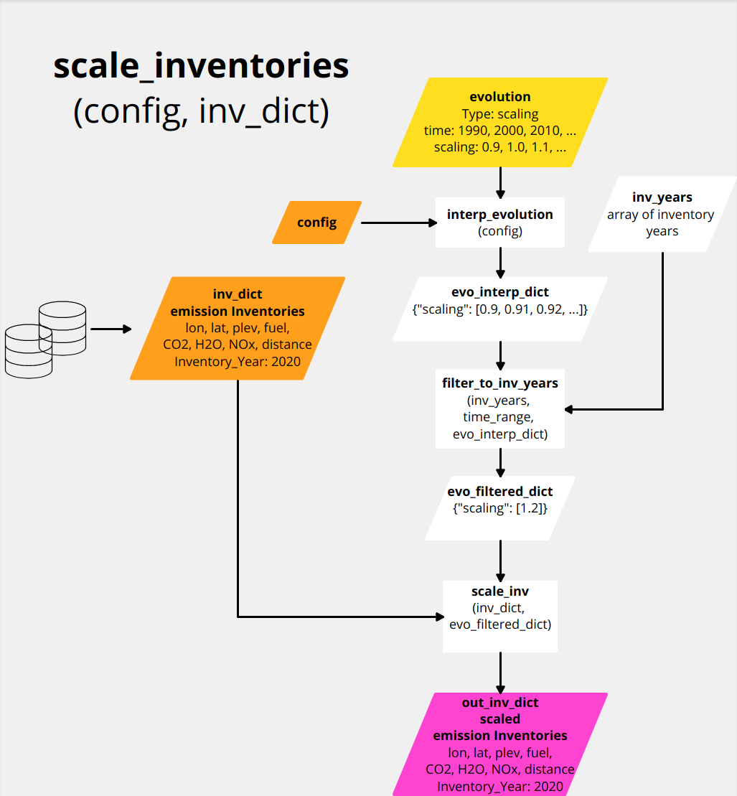
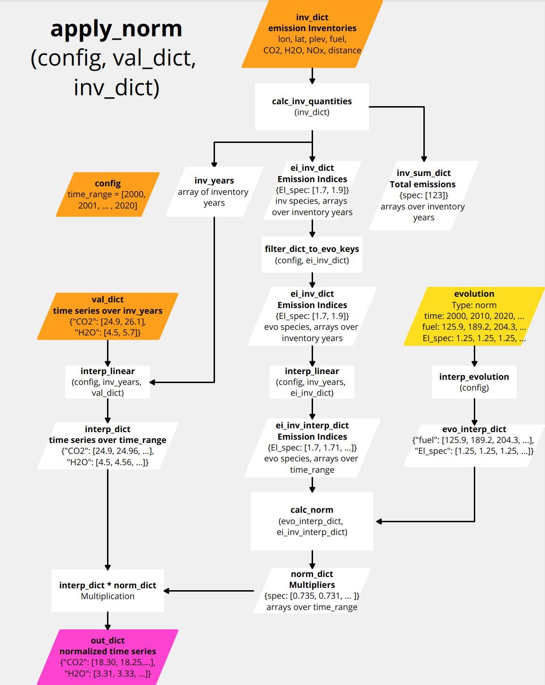
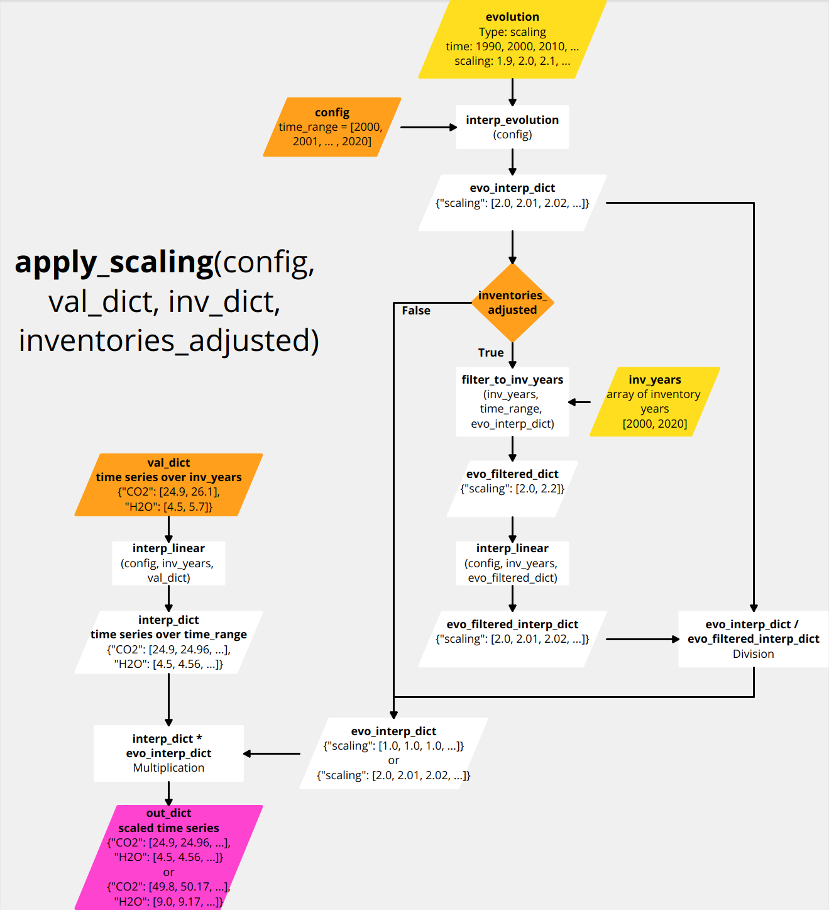
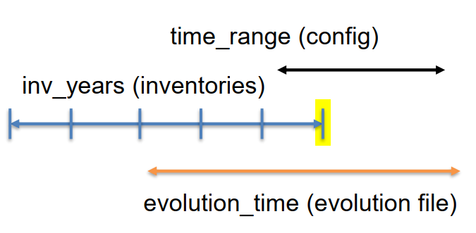
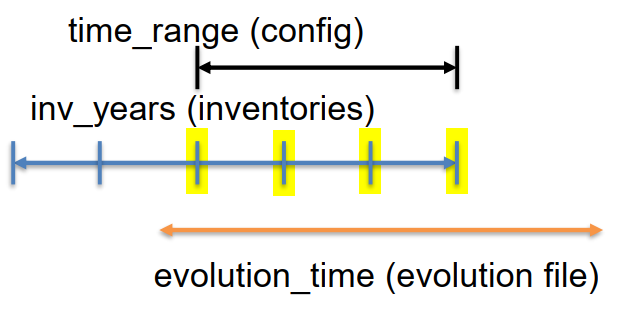
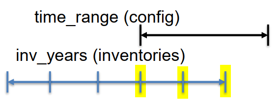

# Time evolution

In OpenAirClim, there exist three types of possible predefined time evolutions:

1. **Normalization** by given time evolution file via fuel use and emission indices.
2. **Scaling** by given time evolution file, scaling/multiplication of all data variables.
3. **No** evolution file given, temporal interpolation between discrete inventory years.

The preferred way is applying any evolution type already on the inventory data itself, i.e. before calculating the responses. Alternatively, time evolution routines can be applied after calculating the responses only. However, this is solely recommended for linear responses. In the following section, the application of time evolution on inventory data is described.

## Adjust inventories

Depending on the user settings in the configuration file, the function `adjust_inventories(config, inv_dict)` applies one of the possible evolution types on the **inventories**. The corresponding settings have to be made within the section (respectively *hash table*) `[time]` in the configuration file.

### Normalization

If a valid time evolution file is set in the configuration, OpenAirClim reads in the netCDF file and checks the global attribute section (metadata). If the key-value pair `Type: norm` is found in the global attributes, the function `norm_inventories(config, inv_dict)` is executed.

The general idea behind the normalization routine is that the driving parameters (fuel use, emission indices and flown distance per fuel use) come from the evolution file. The emission inventories are **normalized** accordingly.

The figure above illustrates the workflow of the normalization routine. First, the evolution data gets processed. The data comprises fuel uses and optionally emission indices for the emitted species and flown distance per fuel use. The evolution data variables are interpolated via function `interp_evolution(config)` to the time range defined in the configuration. This is necessary since the time steps for time range and for evolution data can be different.

Then, the function `calc_inv_quantities(config, inv_dict)` is applied on the dictionary of input inventories `inv_dict`. It outputs the inventory years, the inventory species sums and emission indicies. For further processing, only the emission indices are used which are also available in the evolution data. Therefore, the function `filter_dict_to_evo_keys(config, ei_inv_dict)` filters the emission indices dictionary which have been computed from the inventories.

Since we are interested in adjusting inventories, evolution data is only needed for inventory years. This is done by function `filter_to_inv_years(inv_years, time_range, evo_interp_dict)` (left vertical workflow in the figure).

The filtered fuel use and emission indices from the evolution data together with the computed fuel sums and emission indices from the inventories (right vertical workflow in the figure) are processed within function `calc_norm(evo_filtered_dict, ei_inv_dict)` for calculation of normalization multipliers. Finally, function `norm_inv(inv_dict, norm_dict)` applies these multipliers on the inventory data variables (fuel use, species emissions and distance) in order to create normalized emission inventories `out_inv_dict`.

### Scaling

If a valid time evolution file is set in the configuration, OpenAirClim reads in the netCDF file and checks the global attribute section (metadata). If the key-value pair `Type: scaling` is found in the global attributes, the function `scale_inventories(config, inv_dict)` is executed.

The general idea behind the scaling routine is that the parameters in the evolution file are multipliers. The emission inventories are **scaled** accordingly. This routine is useful for the consideration of changes relative to the emission inventories.

The figure above illustrates the workflow for the scaling routine. First, the evolution data gets processed. In the case of a evolution file of type **scaling**, evolution data comprises a time series of scaling factors. In the current implementation, the scaling factors apply equally to all inventory data variables (fuel use, species emissions and flown distance).

The evolution data variables are interpolated via function `interp_evolution(config)` to the time range defined in the configuration. This is necessary since the time steps for time range and for evolution data can be different.

Since we are interested in adjusting inventories, evolution data is only needed for inventory years. This is done by function `filter_to_inv_years(inv_years, time_range, evo_interp_dict)`. Finally, function `scale_inv(inv_dict, evo_filtered_dict)` performs the actual scaling by multiplying inventory data variables by the scaling factors.

### No evolution

If no evolution file is set in the configuration, **no evolution** is applied, i.e. the inventory output dictionary `out_inv_dict` and the input dictionary `inv_dict` are the same.

## Apply evolution on computed values

After having computed the responses, time evolution is considered by the `apply_evolution(config, val_dict, inv_dict, inventories_adjusted)` function. This is necessary since the responses are only computed for inventory years and we need to evaluate the responses for the interjacent years from the accoording evolution. The bool variable `inventories_adjusted` takes into account if the `adjust_inventories(config, inv_dict)` function has been applied on the input inventories or not. Similarly to the inventory adjustment routine, `apply_evolution(config, val_dict, inv_dict, inventories_adjusted)` applies one of the three possible evolution types on a dictionary `val_dict` of computed values.

### Normalization

If a valid time evolution file is set in the configuration, OpenAirClim reads in the netCDF file and checks the global attribute section (metadata). If the key-value pair `Type: norm` is found in the global attributes, the function `apply_norm(config, val_dict, inv_dict)` is executed.

For this normalization routine, it is irrelevant if the inventories have been adjusted beforehand by `adjust_inventories(config, inv_dict)`.

The figure above illustrates the workflow for the normalization routine. Basically, the computed values in `val_dict` are linearly interpolated over `time_range` and multiplied by normalization factors. The normalization factors are derived as follows.

First, the evolution data gets processed (right vertical workflow in the figure). The data comprises fuel uses and optionally emission indices for the emitted species and flown distance per fuel use. The evolution data variables are interpolated via function `interp_evolution(config)` to the time range defined in the configuration. This is necessary since the time steps for time range and for evolution data can be different.

Then, the function `calc_inv_quantities(config, inv_dict)` is applied on the dictionary of input inventories `inv_dict`. It outputs the inventory years, the inventory species sums and emission indicies. For further processing, only the emission indices are used which are also available in the evolution data. Therefore, the function `filter_dict_to_evo_keys(config, ei_inv_dict)` filters the emission indices dictionary which have been computed from the inventories.
Afterwards, the emission indices derived from the inventories are interpolated over `time_range`.

The interpolated evolution data together with interpolated emission indices from the inventories are processed by function `calc_norm(evo_interp_dict, ei_inv_interp_dict)`. It calculates the normalization multipliers which are finally applied to the computed and interpolated responses.

### Scaling

If a valid time evolution file is set in the configuration, OpenAirClim reads in the netCDF file and checks the global attribute section (metadata). If the key-value pair `Type: scaling` is found in the global attributes, the function `apply_scaling(config, val_dict, inv_dict, inventories_adjusted)` is executed.

For this scaling routine, it is **critical** if the inventories have been adjusted beforehand or not. Therefore, the bool variable `inventories_adjusted` is passed to the function. By default, this variable is set to `False`.

The figure above illustrates the workflow for the scaling routine. Basically, the computed values are interpolated over `time_range` and multiplied by scaling factors. If `inventories_adjusted = False`, the scaling factors correspond to the factors given in the evolution file and interpolated over `time_range`. If `inventories_adjusted = True`, the scaling factors from evolution are normalized. The normalized scaling factors are unity for inventory years, and for interjacent years the factors may differ from unity.

### No evolution

If no evolution file is set in the configuration, `apply_no_evolution(config, val_dict, inv_dict)` is executed. This corresponds to a simple (linear) interpolation of computed values over `time_range`. **If the defined time range has intervals outside the `inv_years` range, OpenAirClim assumes fill values of 0.0, i.e. no emissions are considered for these periods!** A warning is output to ensure that this setting is made intentionally by the user.

## Time constraints

There exist several requirements on the time settings which must be met so that the configuration is considered as valid. These requirements are different for the three evolution types.

### Normalization

Following figure illustrates the time constraints for the evolution type **norm**. Three different time axes have to be considered: `time_range` from the settings in the configuration file, the discrete inventory years `inv_years` from the emission inventories, and the time coordinate `evolution_time` from the evolution file.

Following time constraints have to be met for a valid configuration:

- `time_range` must be within `evolution_time`
- At least one `inv_year` must be within `time_range`
- At least one `inv_year` must be within `evolution_time`

Following inventories are considered during simulation:

- `inv_years` <mark>overlapping</mark> with `time_range`

### Scaling

Following figure illustrates the time constraints for the evolution type **scaling**. Three different time axes have to be considered: `time_range` from the settings in the configuration file, the discrete inventory years `inv_years` from the emission inventories, and the time coordinate `evolution_time` from the evolution file.

Following time constraints have to be met for a valid configuration:

- `time_range` must be within `evolution_time`
- At least one `inv_year` must be within `time_range`
- At least one `inv_year` must be within `evolution_time`
- `time_range` first and last year <mark>must</mark> be inventory years

Following inventories are considered during simulation:

- `inv_years` <mark>overlapping</mark> with `time_range`

### No evolution

Following figure illustrates the time constraints for the evolution type **no evolution**. Two different time axes have to be considered: `time_range` from the settings in the configuration file, and the discrete inventory years `inv_years` from the emission inventories.

Following time constraints have to be met for a valid configuration:

- At least one `inv_year` must be within `time_range`

Following inventories are considered during simulation:

- `inv_years` <mark>overlapping</mark> with `time_range`